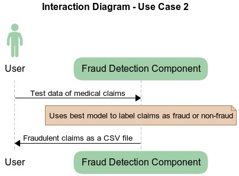

#### Software Components
* **Data Preprocessing Component**
    * ***What it does***: This component performs data preprocessing tasks such as cleaning, normalizing, and formatting the input data. It takes raw data from four sources, namely, Inpatient Data, Outpatient Data, Beneficiary Data, and Fraud Data, and processes the data to make it compatible with the machine learning models used for anomaly detection.
    * ***Input***: raw data from four sources, namely, Inpatient Data, Outpatient Data, Beneficiary Data, and Fraud Data.
    * ***Output***: Clean and formatted dataset ready for analysis.
* **Claims Metadata Analysis Visualization Component**
    * ***What it does***: This component displays visualizations to help users gain insights into patient demographics related to insurance claims. These visualizations include information on state-wise fraudulent claims and the possibility of fraudulent claims based on factors such as the number of days admitted, diagnosis group code, and reimbursement of insurance claim amount. By using this component, users can identify areas with a higher risk of fraud and focus their investigations accordingly.
    * ***Input***: Pre-processed data on patient demographics, claim type, and relevant metadata, as well as user inputs such as specific year.
    * ***Output***: Visualizations such as bar charts and state-wise representations, showing metrics related to patient demographics, diagnosis group code, reimbursement amounts, and trends over time for the pre-processed dataset.
* **Fraud Detection Component**
    * ***What it does***: This component serves the purpose of identifying outliers in the preprocessed data. It does so by utilizing machine learning algorithms, such as clustering, regression, and ensemble, to analyze the preprocessed data and detect any patterns and anomalies present.
    * ***Input***: A test dataset having patient demographics, claim type, and other relevant metadata.
    * ***Output***: A list of flagged claims.
* **Fraud Detection Results Visualization Component**
    * ***What it does***: MENTION THIS
    * ***Input***: A test dataset having patient demographics, claim type, and other relevant metadata.
    * ***Output***: MENTION THIS

#### Interactions to Accomplish Use Cases
- ***Use Case 1: Identifying High-Risk Claims for Review*** -- The Data Preprocessing Component takes in raw data from various sources and preprocesses it to make it compatible with the anomaly detection algorithm. The Fraud Detection Component takes in the preprocessed data and uses machine learning algorithms to identify patterns and anomalies in the data. The Fraud Detection Results Visualization Component takes in the results from the anomaly detection algorithm and generates visualizations that highlight potentially fraudulent claims and model performance metrics.

- ***Use Case 2: Prioritizing Claims for Payment Processing*** -- The Data Preprocessing Component takes in raw data from various sources and preprocesses it to make it compatible with the anomaly detection algorithm. The Fraud Detection Component takes in the preprocessed data and uses machine learning algorithms to identify patterns and anomalies in the data. Based on the results of the anomaly detection algorithm and the metadata analysis, the user can prioritize claims for payment processing.

- ***Use Case 3: Analyzing Medicare Claims through Visualization*** -- The Data Preprocessing Component takes in raw data from various sources and preprocesses it to make it compatible with the anomaly detection algorithm. The Claims Metadata Analysis Visualization Component takes in the preprocessed data and generates visualizations that provide insights into patient demographics, claim type, and trends over time. The user can interact with the visualizations to explore the data and identify potential fraud and abuse.

#### Preliminary Plan
- **Week 8**:
    * Finalize dataset for the analysis and fraud detection.
    * Decide which anomaly detection models to use and test them on the available dataset.
    * Prepare dashboard for the analysis of the prediction results for the different anomaly detection models.
    * Identify interesting patterns and prepare visualization to illustrate them.
- **Week 9**:
    * Complete preparing the dashboard which hosts both the models and the visualizations.
    * Create python package folder and test files.
    * Create Examples folder that contains examples of using the packages.
- **Week 10**:
    * Polish code to be PEP8 compliant and add appropriate documentation on how to use the tools.
    * Create README file that gives an overview of the project, LICENSE file and setup file that initializes the project after it has been cloned.
    * Create final project presentation.
    * Prepare demo for the final presentation.
- **Week 11**:
    * Final presentation and demo of the project on 14th March.

